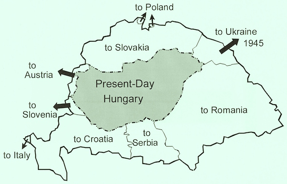

I am a Professor of Economics with a joint appointment at the University of Hawaii Economic Research Organization (UHERO) and the Department of Economics at UH Manoa. My core areas of research include econometrics, time series analysis, forecasting, and the empirical study of international/macroeconomics and tourism/regional economics. I am a coauthor of UHERO's quarterly forecast reports on the Hawaii economy, and I frequently contribute to other applied research targeted at local decision-makers. I earned my PhD degree in Economics at the University of Washington. My ethnicity is Hungarian. I grew up in Czechoslovakia, earned a MS degree in Civil Engineering at the Czech Technical University in Prague, and worked as a management consultant on projects across Europe before moving to the US. I used to ski competitively, but due to the lack of snow in Hawaii, I am now dabbling in surfing.

**Hungarian born in Czechoslovakia?**

Most of the territory currently occupied by Slovakia had been an integral part of Hungary between the years 1000-1918. However, after World War&nbsp;I, the Treaty of Trianon allocated this area to Czechoslovakia (see [Wikipedia](https://en.wikipedia.org/wiki/Treaty_of_Trianon) and the map below for details). Although my grandparents never moved from their native soil, they suddenly found themselves in a different—in some aspects foreign—country. But their (and my) heritage has remained Hungarian.

