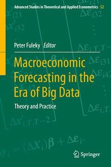

**Contact:**  
2424 Maile Way  
508 Saunders Hall  
University of Hawaii at Manoa  
Honolulu, HI 96822  
USA  
Email: fuleky@hawaii.edu  
Tel: (808) 956-7840

<!-- 
::: {.home-container}
::: {.home-top}
::: {.home-right}
[{.home-book}](https://link.springer.com/book/10.1007%2F978-3-030-31150-6)
:::

::: {.home-left}
{.home-portrait}
:::

# Peter Fuleky

Professor  
[UHERO](http://www.uhero.hawaii.edu/) and [Department of Economics](http://www.economics.hawaii.edu/)  
[Curriculum Vitae](fuleky_cv_quarto.pdf)  
[Bio](bio.qmd)

::: {.home-links}
[**Papers/Research:** Econometrics, Time Series Analysis, Forecasting, Empirical Macroeconomics, Tourism Economics](papers.html)

[**Book:** Macroeconomic Forecasting in the Era of Big Data](https://link.springer.com/book/10.1007%2F978-3-030-31150-6)

**Teaching:**  
[Economic Forecasting](econ427/econ427.html) · [Econometrics I](econ628/econ628.html) · [Anatomy of Production/Utility Functions in 3D](anatomy/anatomy.html)
:::
:::

::: {.home-bottom}
{.home-seal}

**Office:**  
2424 Maile Way  
508 Saunders Hall  
University of Hawaii at Manoa  
Honolulu, HI 96822  
USA  
Email: fuleky@hawaii.edu  
Tel: (808) 956-7840
:::
::: -->
